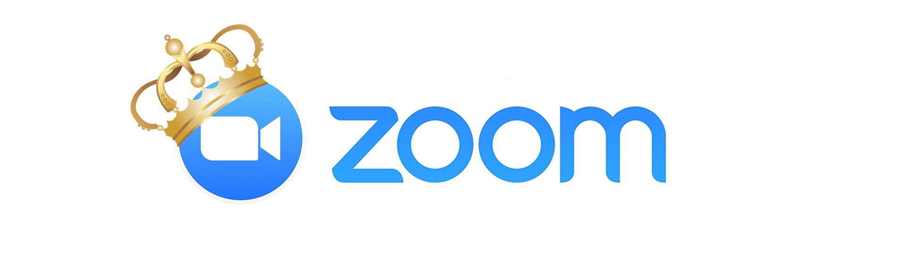

[![Contributors][contributors-shield]][contributors-url]
[![Forks][forks-shield]][forks-url]
[![Stargazers][stars-shield]][stars-url]
[![Issues][issues-shield]][issues-url]
[![MIT License][license-shield]][license-url]
[![LinkedIn][linkedin-shield]][linkedin-url]

<br />
<p align="center">
  <a href="https://github.com/earlonrails/zoom-me">
    
  </a>

  <h3 align="center">Zoom Me</h3>

  <p align="center">
    <a href="https://github.com/earlonrails/zoom-me"><strong>Explore the docs »</strong></a>
    <br />
    <br />
    <a href="https://github.com/earlonrails/zoom-me">View Demo</a>
    ·
    <a href="https://github.com/earlonrails/zoom-me/issues">Report Bug</a>
    ·
    <a href="https://github.com/earlonrails/zoom-me/issues">Request Feature</a>
  </p>
</p>

Zoom Me
======

Have you ever missed a zoom meeting? Never again folks!
Zoom me will use OAuth to authenticate with your google account search your calendar
for zoom meetings and automatically open the link via Google Chrome.

Prerequisites
=============

1. [Create Google App & Credentials File](https://developers.google.com/workspace/guides/create-credentials)
2. Place this credentials file in `src/credentials.json`

Run
===

```
  make run
```


<!-- MARKDOWN LINKS & IMAGES -->
<!-- https://www.markdownguide.org/basic-syntax/#reference-style-links -->
[contributors-shield]: https://img.shields.io/github/contributors/earlonrails/zoom-me.svg?style=for-the-badge
[contributors-url]: https://github.com/earlonrails/zoom-me/graphs/contributors
[forks-shield]: https://img.shields.io/github/forks/earlonrails/zoom-me.svg?style=for-the-badge
[forks-url]: https://github.com/earlonrails/zoom-me/network/members
[stars-shield]: https://img.shields.io/github/stars/earlonrails/zoom-me.svg?style=for-the-badge
[stars-url]: https://github.com/earlonrails/zoom-me/stargazers
[issues-shield]: https://img.shields.io/github/issues/earlonrails/zoom-me.svg?style=for-the-badge
[issues-url]: https://github.com/earlonrails/zoom-me/issues
[license-shield]: https://img.shields.io/github/license/earlonrails/zoom-me.svg?style=for-the-badge
[license-url]: https://github.com/earlonrails/zoom-me/blob/master/LICENSE.txt
[linkedin-shield]: https://img.shields.io/badge/-LinkedIn-black.svg?style=for-the-badge&logo=linkedin&colorB=555
[linkedin-url]: https://linkedin.com/in/earlonrails
[product-screenshot]: images/screenshot.png